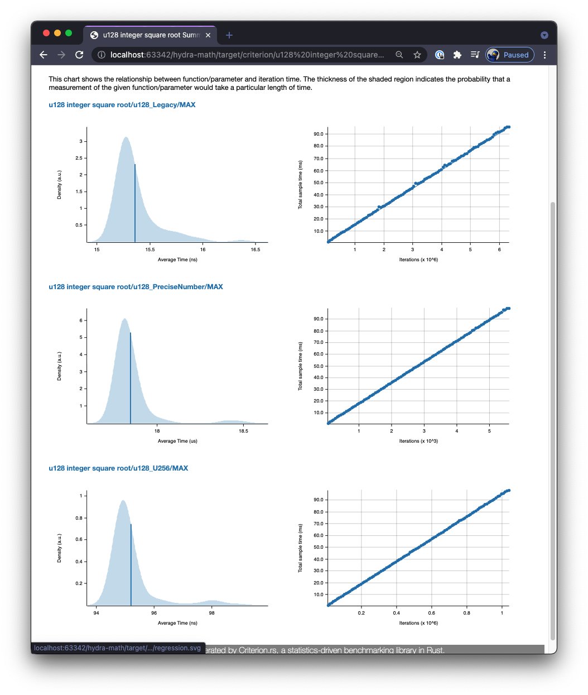

# libs

Libraries to handle math calculations for the hydraswap programs. Currently implemented libraries in [hmm](./hmm)

The code from these libs form the basis for blockchain programs used by hydraswap.

    $ cargo build
    $ cargo test

## Benchmarks

We benchmark high compute functions such as the integer square root.

    $ cargo bench

After running benchmarks, check your local `target/criterion/report/index.html` for analysis.

